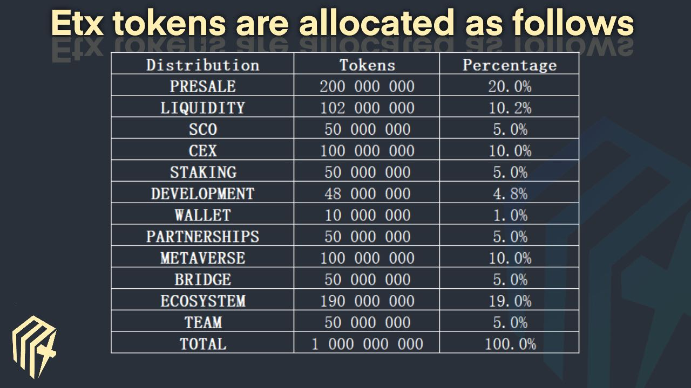
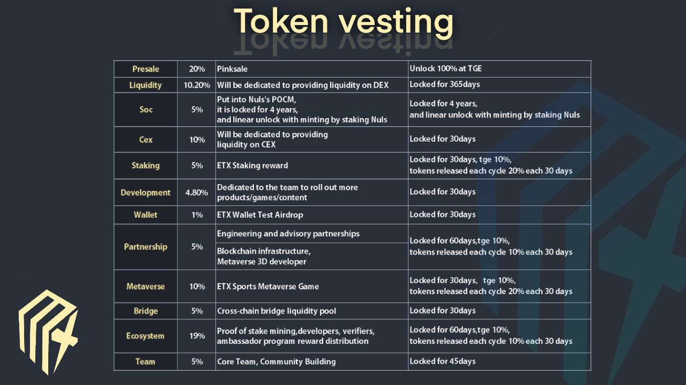

# 💰 11.0  TOKENOMICS

### Developing for the Future

We aren't your average Blockchain project, our team is here to create a project that will last generations. With the future on our minds, all of our team and ecology tokens are vested linearly over 6 months. Protecting all investors in a safer presale.

## ETX Tokens are allocated as follows

<figure><figcaption></figcaption></figure>

## ETX Token vesting

<figure><figcaption></figcaption></figure>

#### ETX Token

Name:                ETXInfinity
\
Contract:           0x7D5b6F2E31B1e50e6a45130f4AdBB8839FAdeb2E\
SYMBOL:           ETX
\
CHAIN    :           BSC
\
SUPPLY :            1 Billion
\
&#x20;  TAX     :            0%\


\

\

\
