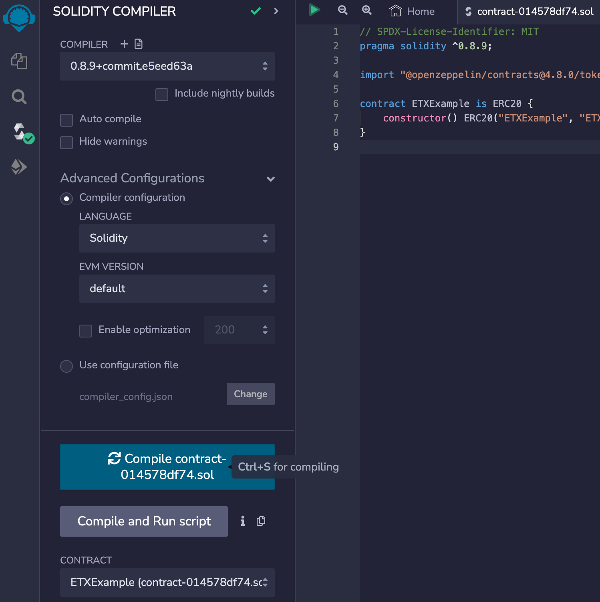

# 8.2 Deploy your own contract

### We recommend you use remix, the online IDE, you do not have to setup all the environment with ETX, RPC is enough.

### Compile and deploy ETX20 token

(1) Open Remix IDE: [https://remix.ethereum.org](https://remix.ethereum.org/)

<figure><figcaption></figcaption></figure>

(2)Create new contract ETX20token.sol and copy contract code from the ETX20 token template.

<figure><figcaption></figcaption></figure>

(3)Compile contract

a. Step1: Click button to switch to compile page

b. Step2: Select “ETX20” contract

c. Step3: Enable “Auto compile” and “optimization”

d. Step4: Click “ABI” to copy the contract abi and save it.

<figure><figcaption></figcaption></figure>

(4)Deploy and confirm in metamask

<figure><figcaption></figcaption></figure>

(5) Waitng the transaction and review on ETXScan

<figure><figcaption></figcaption></figure>

<figure><figcaption></figcaption></figure>
